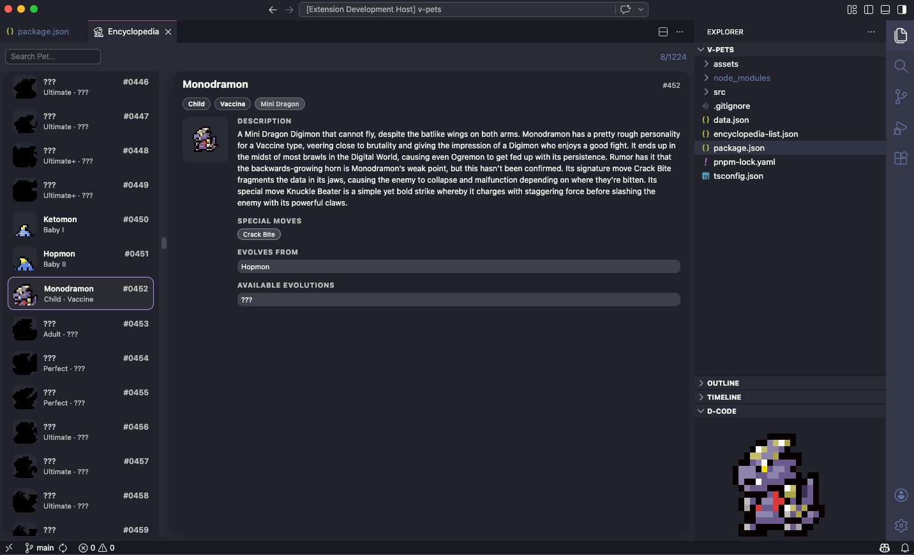

# D-CODE: Virtual Coding Companion

Bring a Virtual Pet into your editor. Your coding companion from the Digital World, always by your side while you write code.

## Features

Raise a small Virtual Pet inside your editor and let it accompany you! D-CODE tightly integrates with your VS Code workflow to create an immersive, rewarding experience out of your daily coding tasks.

- **Raise your Companion:** Your daily coding tasks feed, train, and raise your digital partner.
- **Earn Experience Through Coding:** Every action counts! Gain XP by:
  - Typing and writing code
  - Saving files and maintaining coding streaks
  - Running terminal commands
  - Resolving errors and warnings
  - Performing Git operations (commits, branches, merges)
  - Passing tests and building your project
- **Evolve:** Your companion grows and evolves through multiple stages (Baby I, Baby II, Child, Adult, Perfect, Ultimate, and Ultimate+) based on the experience gathered.
- **Discover & Collect:** Unlock different evolutionary branches, track them in the Evolution Tree, and fill out your Encyclopedia.
- **Customization:** Choose from different visual filters for your pet's screen (Classic LCD, Green monochrome, Dark high-contrast), use discovery mode to prioritise new evolutions, and ignore specific evolution paths if desired.

## Commands

D-CODE provides several commands accessible through the Command Palette (`Ctrl+Shift+P` or `Cmd+Shift+P`):

- `D-CODE: Choose Egg` - Start your journey by selecting a new egg!
- `D-CODE: Show Evolution Tree` - View the evolution paths and monitor your progress.
- `D-CODE: Show Encyclopedia` - Browse all the companions you've discovered so far.
- `D-CODE: Reset all progress` - Erase your saved data to start from scratch.

## Configuration

D-CODE is highly customizable, putting you in control of your companion's progression. Adjust the experience yield for each activity to match your coding pace!

- **Visual Settings:** LCD Filters, Exclude Pets
- **Progression Adjustments:** Fine-tune the XP required for each evolutionary stage.
- **Activity Yields:** Customize the experience awarded per action, such as `typing`, `git commit`, `errors and warning cleanups`, `tests passing`, and much more!

## Intellectual Property Notice

This project is an unofficial fan-made project.

Digimon and all related characters, names, sprites, logos, and other intellectual property are owned by their respective rights holders.

This repository only licenses the original source code created for this project under the Apache 2.0 License.

No rights are granted over any third-party intellectual property.

## License

[Apache-2.0 license](https://github.com/aitorllj93/d-code/blob/main/LICENSE)